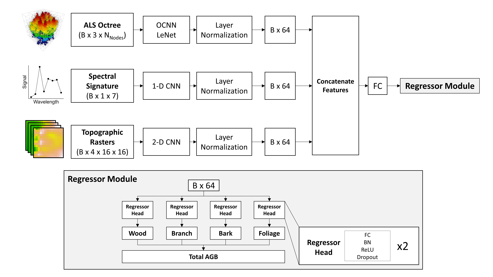

# Forest Biomass Estimation Using Deep Learning Data Fusion of LiDAR, Multispectral, and Topographic Data

## Citation
...

## License:
This project is licensed under the MIT License. See the `LICENSE` file for more details.

## Referenced Repositories
The following GitHub repos were essential in the development of the code used in this study:

- [OCNN-Pytorch](https://github.com/octree-nn/ocnn-pytorch)
- [1-D CNN For Global Canopy Height Regression](https://github.com/langnico/GEDI-BDL)

 